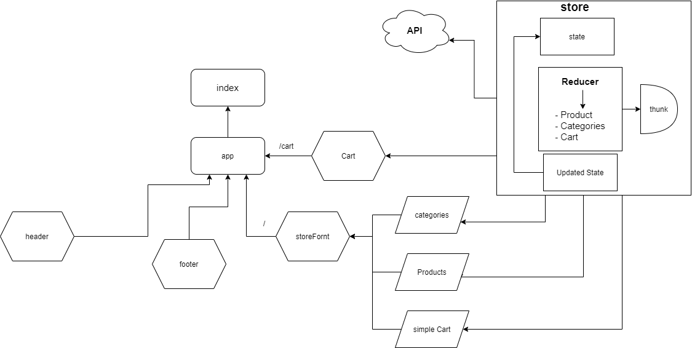

# Virtual Store

## Table of Contents

- [About](#about)
- [Author](#Author)
- [Getting Started](#getting_started)
- [Deployment](#Deployment)
- [UML](#UML)

## About <a name = "about"></a>

An online shopping portal for a fictional store that will allow our users to browse our product offerings by category, place items in their shopping cart, and check-out when they are ready to make their purchase


## Author <a name = "Author"></a>

Mousa Sbbah

## Getting Started <a name = "getting_started"></a>

- clone the repo 

```
git clone <REPO URL>
```

- to install all the packages after clone

```
npm install
```

- start the application
```
npm start
```

### Deployment <a name = "Deployment"></a>

#### **Netlify** link:  https://frontstore199.netlify.app/


## UML diagram <a name = "UML"></a>


